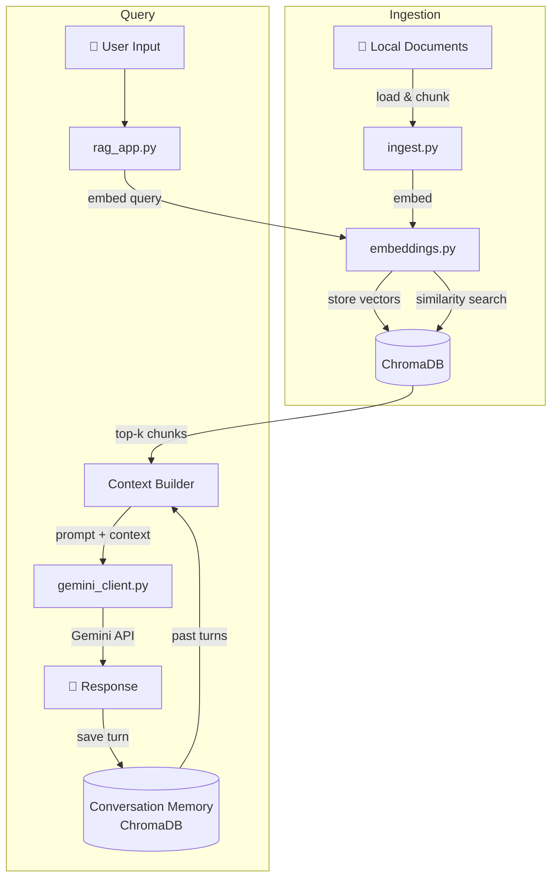

# 🤖 RAG Personal Assistant


A personal AI assistant powered by a **Retrieval-Augmented Generation (RAG)** pipeline. Ingests your own documents locally, stores them as vector embeddings in ChromaDB, and answers questions using Google Gemini — with full memory of past conversations.

---

## ✨ Features

- 📄 **Local document ingestion** — ingest any text files into a persistent vector store
- 🔍 **Semantic search** — retrieves the most relevant context before answering
- 🧠 **Conversation memory** — past interactions are stored and retrieved for context-aware responses
- 👤 **Dual mode** — `creator` mode for full access, `public` mode for read-only Q&A
- 🔒 **Fully local** — your documents never leave your machine

---

## 🏗️ Architecture



---

## 🗂️ Project Structure

```
rag-personal-assistant/
│
├── src/
│   ├── embeddings.py       # Embedding generation & vector search
│   ├── gemini_client.py    # Google Gemini API wrapper
│   ├── ingest.py           # Document loading & ingestion pipeline
│   └── rag_app.py          # Main app — orchestrates RAG loop
│
├── tests/
│   ├── __init__.py
│   ├── test_embeddings.py  # Unit tests for embedding logic
│   ├── test_ingest.py      # Unit tests for ingestion pipeline
│   └── test_gemini_client.py # Unit tests for LLM client
│
├── docs/                   # Documents to ingest
├── chroma_db/              # Persistent vector store (git-ignored)
├── .github/
│   └── workflows/
│       └── ci.yml          # CI: lint + tests on every push
├── Dockerfile
├── .env.example
├── .gitignore
├── pyproject.toml
└── README.md
```

---

## 🚀 Getting Started

### Prerequisites
- Python 3.11+
- [Poetry](https://python-poetry.org/docs/#installation) 1.8+
- A [Google Gemini API Key](https://aistudio.google.com/app/apikey) (free tier available)

### Installation

```bash
# 1. Clone the repo
git clone https://github.com/mariaDuarte98/rag-personal-assistant.git
cd rag-personal-assistant

# 2. Set Python version and install dependencies
poetry env use python3.11
poetry install

# 3. Configure environment
cp .env.example .env
# Add your GEMINI_API_KEY to .env
```

### Usage

```bash
# Ingest your documents (put .txt files in /docs first)
poetry run python src/ingest.py

# Start the assistant
poetry run python src/rag_app.py
```

Type `exit` or `quit` to stop the session. All conversations are automatically saved.

---

## 🧪 Running Tests

```bash
poetry run pytest tests/ -v
```

---

## 🐳 Docker

```bash
# Build
docker build -t rag-personal-assistant .

# Run
docker run -it --env-file .env rag-personal-assistant
```

---

## 🔑 Environment Variables

| Variable | Description |
|---|---|
| `GEMINI_API_KEY` | Your Google Gemini API key |

Copy `.env.example` to `.env` and fill in your values.

---

## 📝 License

[MIT](LICENSE)